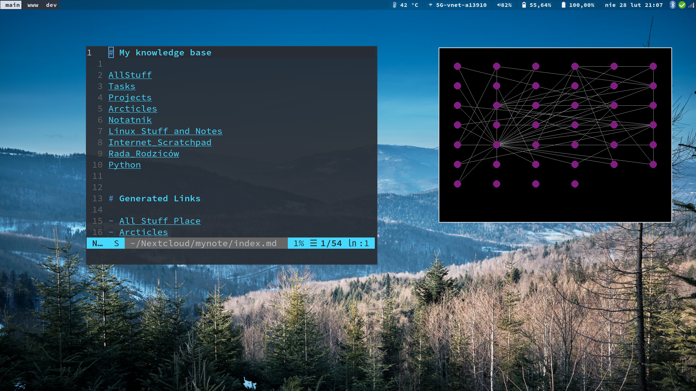

# The Vimwiki Link Map
This is a simple procejt that is my attempt to ceate mind map like graph crator for wim viki systems.

## The story

As I started to use Vimwiki to crate all my notes and in general try to work on system of a "second brain" I noticed that with the standard markdown notation that I prefer to use I cant easily display all connections (links) in the notes as a mind-map.
More less like it is in the Obsidian app, which seem to be really cool, except it cant be used in terminal :(

To overcome this - This is my attempt to create an app that will add such functionality. 

## How it work (or it will hopefully)
It goes over all .md files in given directory and sub dirs and analyze each file, extract links data. Later it draws circle for each file and draw line between those ones that have interlinks.

At the moment it looks like this:

## Plan (TODO):
- Adding interactivity for mouse and keys
- Adding some physics - probably spring forces
- ...who knows...
